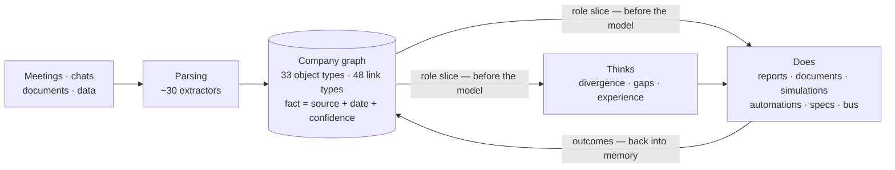
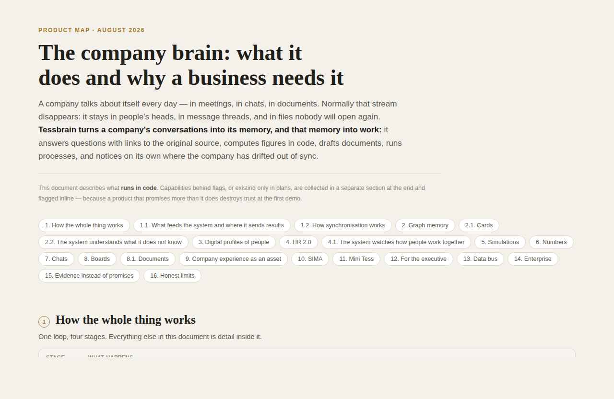
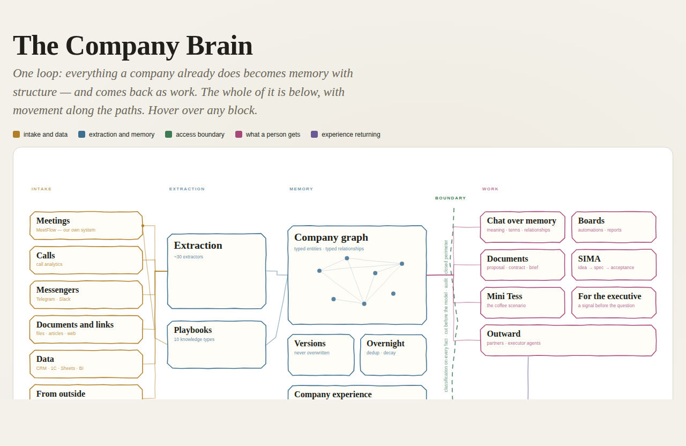
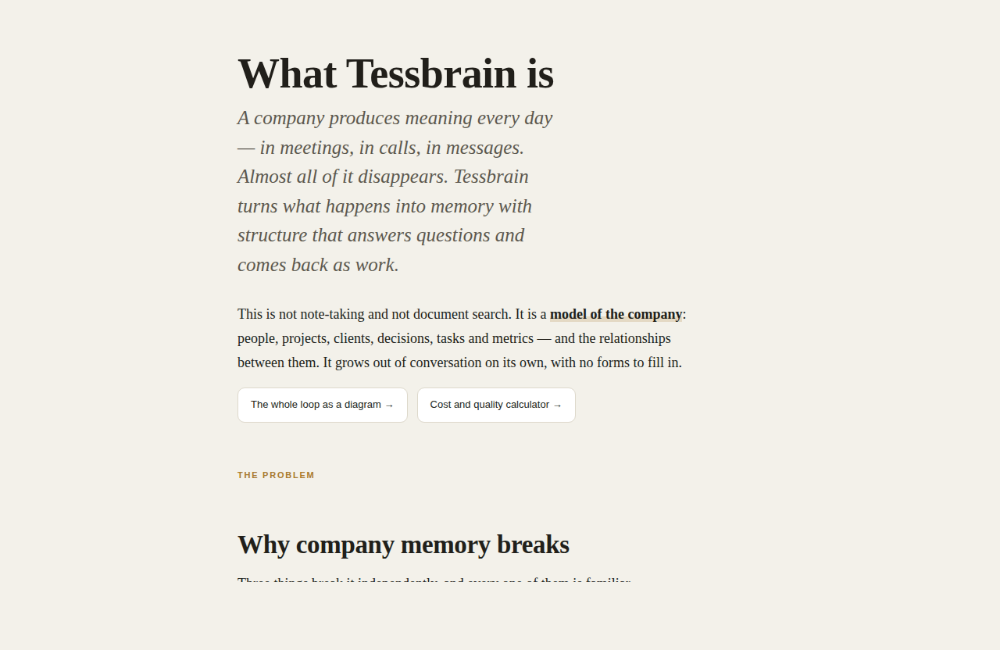
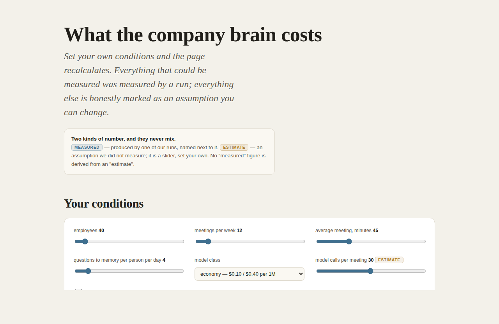

# Tessbrain

**The company brain: it remembers, it thinks, and it does the work.**

Meetings, calls and documents become a connected memory. It answers with
sources, notices divergence on its own — and comes back as finished work:
reports, documents, automations, and specs for AI executors.

🇷🇺 [Русская версия](README.ru.md) · 🌐 [tessent.ai](https://tessent.ai/en) · 🏢 [synlabs.pro](https://synlabs.pro/)

[](https://github.com/neskuchny/Tessbrain/actions/workflows/ci.yml)
[](https://github.com/neskuchny/Tessbrain/actions/workflows/offline-checks.yml)


[](https://youtu.be/6LE8CYxQH7w)

*▶ 3-minute demo on YouTube*

---

## What it is

In summer 2026, Y Combinator named the **company brain** a category in its
Request for Startups — "Every company in the world will need one." Almost
everyone building in this niche builds memory: a fact layer for other
people's agents, knowledge baked into model weights, enterprise search,
meeting notes.

Tessbrain takes a different spot inside the niche: **memory here is the
foundation, not the product.** The product is what stands on top of it —
a system that helps run the company on its own data.

- **Watches the company for divergence.** Sales commits to October while
  engineering plans for December — the system says so before it gets
  expensive.
- **Builds a new kind of reporting.** Visual reports people actually read,
  and documents assembled from what was already said.
- **Executes tasks.** Automations described in plain words that query
  company memory instead of an empty model — plus executing agents.
- **Prepares work for AI.** An employee's idea becomes a verifiable spec
  grounded in company data: an external AI implements it, the system
  checks the result.

Underneath is a typed knowledge graph that grows out of conversations by
itself, no forms to fill: every fact carries its **source, date and
confidence**, and access control is enforced **before the model**.

One loop — from conversation to work and back:



## It remembers: a graph with provenance on every fact

- **Feeds on what the company already produces:** meetings, messengers
  (Telegram, Slack), documents and tables — with privacy at the source:
  the owner decides what enters shared memory and what stays personal
  context.
- One meeting is processed by **~30 specialized extractors**; facts become
  nodes and links of a typed graph — **33 object types, 48 link types** —
  not a pile of summaries.
- Facts are **versioned, never overwritten**: the system answers both
  "what is the budget now" and "what was it in March, when did it change,
  and why".
- Every answer comes **with citations**. "What did we promise the bank on
  timing?" → two conflicting dates from two meetings, with links to both.
- Access is cut **before the answer is synthesized**: a restricted fact is
  removed from context before generation. Ask about salaries as an
  intern — the fact doesn't exist. Not "access denied" — invisible.

## It thinks: notices what nobody asked about

- **The synchronization loop.** Cross-checks between people, teams and
  goals run on a schedule, not when somebody remembers to ask: a per-topic
  sync index, an honest "unknown" where data is thin, and notifications to
  the parties involved rather than a public channel.
- **Night self-curiosity.** The system reads its own profile of the
  company, finds blind spots — "what important thing do I not know?" —
  and orders itself the research. Every conclusion lists what's missing
  for confidence, priced by the cost of finding out.
- **Experience learned from outcomes.** Decisions are linked to how they
  actually ended (mined from retrospectives). Confidence grows only from
  confirmed outcomes: ten discussions with unknown endings give low
  confidence, not high. Old patterns decay, and contradicting cases speed
  the decay roughly threefold.
- It knows the difference between "no similar cases" and "archive
  unavailable" — and never serves the second as the first.

## It does: memory comes back as work

- **Reports people read.** Visual reports in six formats; a report
  remembers its predecessor and talks about what changed; the numbers
  inside are recomputed by code, not improvised by the model.
- **Documents from memory.** Proposals, summaries and regulations built
  from what was already said; what the system genuinely doesn't know is
  marked red, not invented. The "coffee scenario": by the time you walk
  back from the meeting room, drafts for your role in that meeting are
  ready — the founder gets the summary, sales gets the client letter.
  Delivered by Mini Tess, the employee's assistant in the messenger.
- **Profiles and simulations: rehearsal before reality.** Digital profiles
  of people — the manner of speech, decisions and opinions of a specific
  person, not a role résumé. Simulation of a real client from the graph,
  a boardroom session of roles and profiles with a disagreement protocol,
  a negotiation prep pack.
- **Automations in plain words.** "Every Monday, collect the week's
  results and send them to me as a picture" — the system builds the flow
  itself, labels every block, and runs it on schedule or on company events
  (meeting ended, task overdue, email arrived). Inside there's an "ask the
  company brain" block; if a step fails, everything downstream stops — no
  letters composed out of nothing; a human-approval step can sit in the
  middle. 31 ready-made flows out of the box.
- **Specs for AI executors (SIMA).** An employee who can't code describes
  the mini-service they need, by voice or text. It becomes a structured
  spec where every requirement carries a supporting quote from company
  data; built-in roles argue with the author (strategist, user simulator,
  economics); the system writes the acceptance checks itself. The spec
  exports in executor formats — Cursor, Claude Code, Lovable — and a
  failed acceptance goes back with notes. Launch is always a human's
  button.
- **A data bus and external agents.** A contractor, partner or another
  company's agent gets a key and exactly its slice of memory — live
  answers, not a file export; the slice is applied before the model, and
  the key has a lifetime, a quota, a journal and one-click revocation.
  Executing agents take tasks on their channel and deliver results under
  machine acceptance. Where the bus leads — external agent chains
  orchestrated by the brain, the brain as a source for other systems, and
  a network of companies with new HR processes at the intersection of
  their people data — honestly, with the status of each mechanic:
  [docs/en/data-bus-vision.md](docs/en/data-bus-vision.md).

**Full capability map — 22 sections:** [docs/en/product-capabilities.md](docs/en/product-capabilities.md)
· visual versions: [capability map](https://neskuchny.github.io/Tessbrain/share/en/tessent_capabilities.html)
· [system diagram](https://neskuchny.github.io/Tessbrain/share/en/tessent_map.html)
· [what Tessbrain is (article)](https://neskuchny.github.io/Tessbrain/share/en/tessent_article.html)
· [cost calculator](https://neskuchny.github.io/Tessbrain/share/en/tessent_cost.html)
· [competitive map (RU)](https://neskuchny.github.io/Tessbrain/share/ru/tessent_competitivemap.html)

| [](https://neskuchny.github.io/Tessbrain/share/en/tessent_capabilities.html) | [](https://neskuchny.github.io/Tessbrain/share/en/tessent_map.html) |
|:---:|:---:|
| **[Capability map →](https://neskuchny.github.io/Tessbrain/share/en/tessent_capabilities.html)** | **[System diagram →](https://neskuchny.github.io/Tessbrain/share/en/tessent_map.html)** |
| [](https://neskuchny.github.io/Tessbrain/share/en/tessent_article.html) | [](https://neskuchny.github.io/Tessbrain/share/en/tessent_cost.html) |
| **[What Tessbrain is →](https://neskuchny.github.io/Tessbrain/share/en/tessent_article.html)** | **[Cost calculator →](https://neskuchny.github.io/Tessbrain/share/en/tessent_cost.html)** |

---

## How it differs

| The category | What it gives you | Where it stops |
|---|---|---|
| Meeting notetakers | a summary of each meeting | meetings never connect; the summary just lies there |
| Enterprise AI search | an answer when you ask | notices nothing on its own |
| Memory for AI agents | a fact layer or fine-tuned weights | infrastructure under the hood, not a working environment to run a company |
| Agent builders | agents over uploaded documents | memory doesn't grow from conversations by itself |
| Automation platforms | trigger → action chains | the blocks run on a model that doesn't know your company |

Tessbrain is **one graph under all of these jobs**: the same memory answers
questions, watches synchronization, writes the reports, powers the
automations and grounds the specs. Per our competitive map, assembled from
public sources, no player of the eight we profiled combines "graph + people
profiles + simulations + boardroom sessions + executing agents" in one
system — and client simulation with profile-based boardroom sessions we
found at nobody at all. The name-by-name comparison — the eight profiles,
the capability grid and the honest "where we are weaker" rows — is in the
[competitive map](https://neskuchny.github.io/Tessbrain/share/ru/tessent_competitivemap.html),
which so far exists in Russian only.

---

## Run it

Three paths, by how much infrastructure you want to give it:

| Path | What it takes | Where |
|---|---|---|
| **See it in 10 minutes** | Docker + a model key | [quickstart](docs/en/quickstart.md) |
| **Zero infrastructure** | Python and 8 GB of RAM — graph and vectors in local files | [deploy/README.md](deploy/README.md), tier 1 · honest limit: login and meeting ingestion still require a Supabase-compatible stack |
| **Production** | a VPS with 8 GB+ | [deployment](docs/en/deployment.md) + [deploy/single-vps/](deploy/single-vps/) |

---

## Try it without your own data

The repo ships with **Helion**, a synthetic 85-person US company: 20 meetings
with full transcripts, 14 planted storylines and a machine-checked ground
truth. Ask "what did we promise Titan Bank on timing?" — and watch the system
surface the conflict, with sources.

The corpus also comes **pre-extracted** (`demo/helion/extracted/` — every
meeting already run through the full pipeline), so the memory fills in one
command: no model key, nothing billed, no waiting.

```bash
USE_NETWORKX=true USE_QDRANT=false python scripts/seed_demo.py --corpus demo/helion
```

Prefer to watch the extraction happen live? Run the real pipeline (needs a
model key):
`python scripts/ingest_data.py --source files --target demo/helion/transcripts --group public`

→ [demo/helion](demo/helion/) (validator included: 20/20 green) · the Russian
original is [demo/gelion](demo/gelion/)

---

## Deployment: three tiers

Same product, three ways to run it — pick by company size.

| | Tier 1 · Zero infrastructure | Tier 2 · Single VPS | Tier 3 · Holding |
|---|---|---|---|
| for | up to ~20 people, trying it out | up to ~50 people | corporation, multiple entities |
| external services | **none** — graph and vectors in local files, local embedding model | Postgres, Redis, Qdrant, Neo4j in containers | managed databases |
| isolation | single org | RLS optional | RLS + holdings console + federation |

→ [deploy/README.md](deploy/README.md) for the full guide, including the
honest limits of each tier (tier 1 today runs the memory/search engine over
data you load yourself; login and meeting ingestion still require a
Supabase-compatible stack — documented, not hidden).

---

## Honest numbers

The numbers below measure the foundation — memory retrieval: the part of
the product public benchmarks exist for. We publish results **including the
ones we lose**. On [BrainBench](https://github.com/garrytan/gbrain-evals) —
someone else's corpus, someone else's queries, run in *their* runner:

| | P@5 | R@5 |
|---|---|---|
| our BM25 alone (control) | 0.161 | 0.597 |
| **Tessbrain, default config** | **0.316** | **0.900** |
| Tessbrain, `CONFIDENT_GRAPH=on` (ships off) | 0.729 | 0.991 |
| gbrain, as published by them | 0.491 | 0.979 |

On defaults we are **behind** their graph system and ahead of every
non-graph baseline they publish. The flag that puts us ahead ships **off**,
because all 145 questions in that suite have the same shape, and a number we
won't serve by default has no business in a headline. The full story —
including how we first published an inflated number, found the fitted rules
in our own benchmark script, and corrected it — is in
[docs/en/benchmarks.md](docs/en/benchmarks.md).

Also measured: LongMemEval, LoCoMo, HotpotQA, QMSum, faithfulness —
[docs/en/what-we-tested.md](docs/en/what-we-tested.md).

---

## What it doesn't do

This is part of the product, not fine print: a product that overpromises
loses trust at the first demo.

- Secrecy levels are not assigned automatically: every fact defaults to
  "internal"; higher restriction is set by hand.
- SIMA's acceptance verifies stated conditions but does not run the
  delivered code. There is no agent-to-agent negotiation — it's
  "task → result" under machine acceptance.
- The experience layer has no screen of its own yet (API only), and its
  quality is unmeasured; outcomes come from what people said at
  retrospectives, not from metrics.
- Cross-company exchange works inside one deployment; there is no
  discovery between deployments.
- All published numbers were obtained on cloud models; the harness for
  measuring an air-gapped setup exists, the measurement itself hasn't
  been run.

The full list is the "Honest about limits" section of the
[capability map](docs/en/product-capabilities.md).

---

## Documentation

| Start here | |
|---|---|
| [Overview](docs/en/overview.md) | what the system is, in 10 minutes |
| [Quickstart](docs/en/quickstart.md) | first run |
| [Architecture](docs/en/architecture.md) | how the pieces fit |
| [Security](docs/en/security.md) | access control, audit, perimeter |
| [Product capabilities](docs/en/product-capabilities.md) | the full 22-section map |
| [Benchmarks](docs/en/benchmarks.md) | numbers, including losses |
| [Data bus](docs/en/data-bus-vision.md) | what works today and where it leads |

Full documentation index — 21 documents across five sections:
[English](docs/en/README.md) · [по-русски](docs/ru/README.md).
Shareable HTML pages (both languages, self-contained):
[docs/share/](docs/share/)

---

## Tests

No framework to install — every file runs on its own:

```sh
python tests/unit/test_brainbench_port.py
python tests/unit/test_relational_answer_type.py
python tests/unit/test_interval_algebra.py
```

---

## Who builds this

Tessbrain (ex-Tessent — the old name lives on in the team's domain) is
built by **[SYNLABS](https://synlabs.pro/)** — the team behind
[tessent.ai](https://tessent.ai/en). We use it ourselves, and we publish the
benchmark numbers we lose along with the ones we win.

If you are deploying this and want something that isn't here — a connector
to a system we don't support, an extractor for your domain, help fitting it
to how your company actually works, or a hand with a serious multi-tenant
install — write to **info@synlabs.pro**. That kind of work is how the open
version stays funded, so the ask is genuine rather than polite.

Bug reports and pull requests need no contract: open an issue.

## Licence

Apache-2.0. See [`LICENSE`](LICENSE) and [`NOTICE`](NOTICE).
